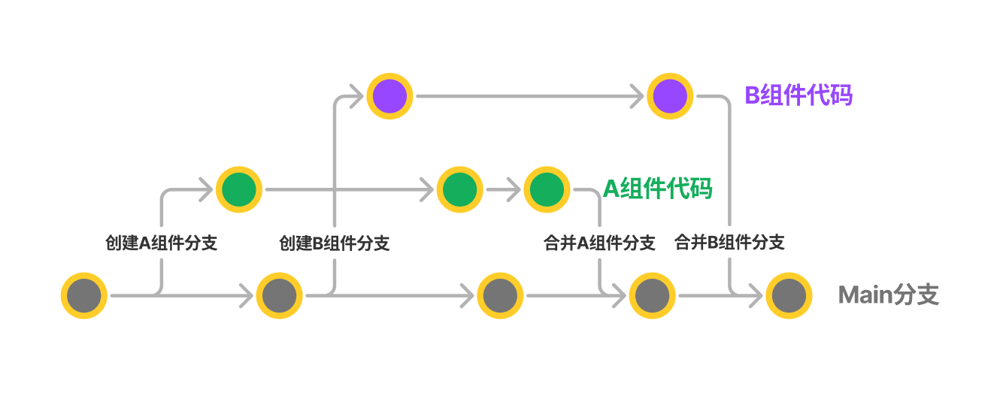

# 为项目编写前端组件 入门须知

### 致各位项目组成员

#### 提交流程

从哪一条主线创建的分支，就是复制一份主线到分支，修改分支的期间主线不会被更改，当分支被合并到主线后，主线才会更改



#### 如何在自己的工作区分支来进行你的组件编写

比如 我需要修改 `mainDisplay`这个组件  这个组件内部可能也会引用其他的子组件 不需要去管 ，我们只需要创建一个自己的分支，这个分支的名称就是你修改的最外层的那个组件的名称

比如`自己的名称/网名-需要修改的最外层的组件的名称-修改（fixes）/更新（uograde）/添加（add）`

类似于这个样的分支命名 `wangzipeng-mainDisplay-upgrade`

**目前我们的主要的任务为为网页前端构建各种类型组件ElementUI-plus**

```
#ElementUI-plus网址
#可以在此处了解到详细的组件格式与命名方法
https://element-plus.org/zh-CN/component/overview.html
```

#### 如果你对如何编写vue组件流程感到困惑或者不知如何编写代码可以阅读以下部分

### 1.下载npm包管理器

对于初次使用vue环境的人需要先下载 npm 包管理器 (最好不要下载到C盘)

[Windows版本 下载地址](https://nodejs.org/dist/v22.11.0/node-v22.11.0-x64.msi)

[MacOS版本 下载地址](https://nodejs.org/dist/v22.11.0/node-v22.11.0.pkg)

### 2.部署Vue环境

当你使用git clone 当前的代码库后，在vscode下转到`/Progream_web/codesource-vue`目录下


使用

```
npm install
```

即可完成前端开发所需要的所有环境依赖

### 3.代码编写

在前端开发期间，只需增添修改  `/codesoure-vue/src/components` 当中的组件

并在 `/codesoure-vue/src/App.vue` 引用并注册你在 `components` 编辑好的以`.vue`命名的组件刷新网页之后就可以生效

##### vue的格式要求 (选项式API) 文件后缀名称.vue

```
<template>
  //此处放置html文件
  <div>
    <h1>{{ value }}</h1>
  </div>
</template>

<script>
  //此处为你所需要放置的数据
  export default{
    data(){
      return{
        value: 'Hello World'
      };
    }
  }
</script>

<style>
  //相应的css格式
</style>
```

### 4.如何注册你在`/components`里编写的组件

找到`/src里的APP.vue`文件

在 **App.vue** 内部添加你在`/components`里编写的组件 如（sampleTest.vue）

```
//引用组件 在import后面紧跟着的这个 sampleTest 名称是你自己定义的
import sampleTest from './components/sampleTest.vue'

//注册组件（以便在App.vue当中使用你的编写的组件）
components：{
  sampleTest,   <-----这个地方就是你注册的方 把你刚刚import引用时 自定义的名字填入其中
}
```

以下例子为 `App.vue` 内部的代码

```
<script>
import HelloWorld from './components/HelloWorld.vue'
import ProgressBar from './components/ProgressBar.vue';
import InfoMessage from './components/InfoMessage.vue';
import ProgressLine from './components/ProgressLine.vue';
import sampleTest from './components/sampleTest.vue';       <-------第一步就是import引用

export default {
  name: 'App',
  components: {
    HelloWorld,
    ProgressBar,
    InfoMessage,
    ProgressLine，
    sampleTest         <-------------------------------------------第二步就是在components里注册你引入的组件
  }
}
</script>
```

### 5.如何使用你自己编写的组件

在App.vue引用并注册你的组件之后，如`sampleTest`( **注意！这是你刚刚在上一步注册时自定义的名称** )

```
//在<template>标签当中加入你写的组件
<template>
  <div>
    /*
      这个地方就是加载你的组件，你可以以标签的形式加载你的组件
      要注意的是，在import引用时 最好使用驼峰命名法 如 sampleTest 因为Html当中不区分大小写，
      如果使用驼峰命名法，因为sampleTest里有大写字母 T 那这样就可以以 T 为分界线在html里写成<sample-test>
    */
    <sample-test></sample-test>   
  </div>
</template>
```

### 6.网页调试

组件编写完毕或者需要测试的时候

跟初次使用那部分打开终端的步骤一样打开终端

```
# 启动网页（调试）
npm run serve

# 构建网页（一般用不到）
npm run build
```

这样就可以看到自己制作的网页组件了


## Under construction(敬请期待)


Scientific Planning Program web page
